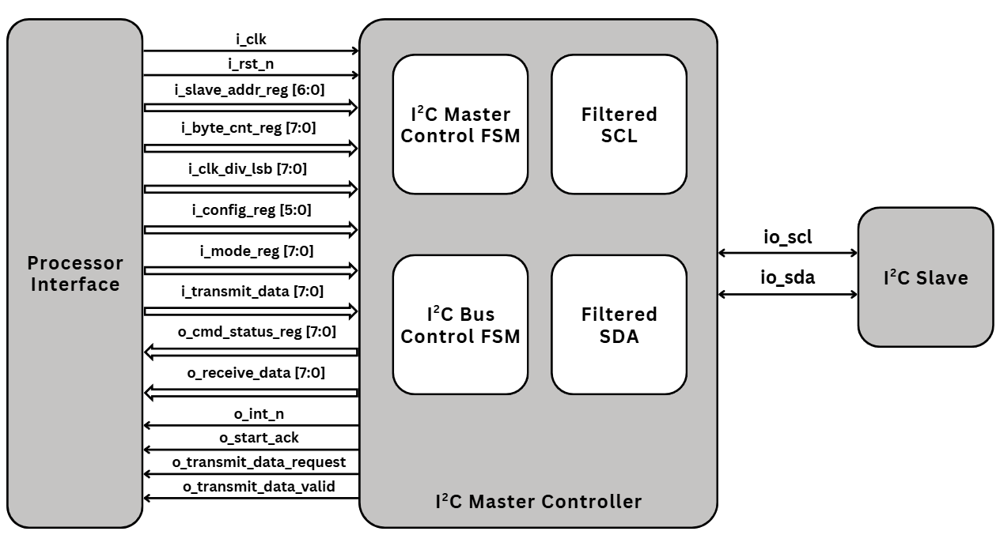
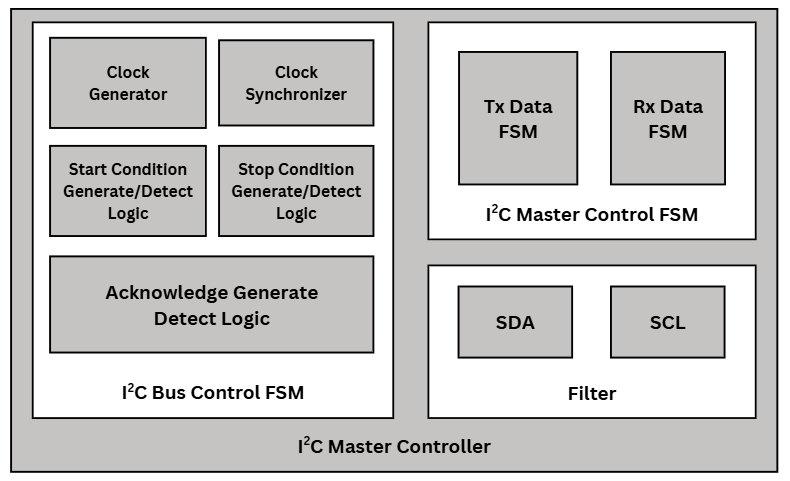

# EE5303 — I2C Master Controller
Báo cáo môn **Advanced Digital IC Design (EE5303)**: thiết kế **I2C Master Controller** theo kiến trúc tham chiếu **Lattice RD1139**.
## I2C Master Controller Block Diagram

## I2C Functional Block Diagram

